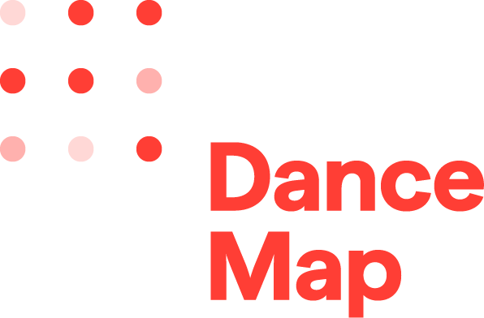

# WP2: Mapping European Dance Heritage

### Coventry University / C-DaRE

### Joe Askew, Marie-Louise Crawley, Rachael Davies, Simon Ellis, Lily Hayward-Smith, Kathryn Stamp & Charlotte Waelde

  
  

Note:

---

## WP2 overview

- Survey ➞ European dance heritage knowledge graph (shared with WP4)
- D2.1 (M3) and D2.2 (M18) delivered
- Analysis & application continues

Note:
- *3 bullets*
- WP2 objective: build survey (D2.1) and feed data into the European artistic dance heritage Knowledge Graph (D2.2) – a single artefact developed w WP4 Wikibase.
- analysis, enrichment and application of findings continue as part of WP2/3/4/7 collaboration. 
- Focus today: what's happened since D2.2, and what's still being worked through.

---

## Key findings from the survey

- Sector's framing of "dance heritage" ≠ UNESCO's 2003 ICH categories
- Key themes: embodied knowledge, creative reactivation of archives, heritage as evolving
- Funding is the dominant need
- Majority engage marginalised communities/practices

Note:
- *4 bullets*
- Qualitative: free-text responses on what "dance heritage" means showed considerable disagreement over definition, even though the underlying activity described is coherent — pointing to a mismatch with the UNESCO 2003 Intangible Cultural Heritage Convention's categories. This is feeding a forthcoming article by the team.
- Recurring priorities from the qualitative coding: valuing knowledge held in the body; encouraging artists to reactivate archival material creatively; representing a wider range of histories and communities; treating dance heritage as something that shifts and evolves rather than staying fixed.
- Quantitative: funding flagged as a future need by 85.9% of respondents and the single most urgent need for 50.5%; 
- 60% said their work focuses on marginalised communities/practices.

---

## Survey to graph

  

    <ul>
      <li class="fragment fade-up" data-fragment-index="0">Survey data ➞ Wikibase graph</li>
      <li class="fragment fade-up" data-fragment-index="2">Structured data ingested; open text is harder</li>
    </ul>
  

  

    

      
    

  

Note:
- *2 bullets, + diagram*
- D2.2 supplied the survey-derived data into the shared Wikibase-hosted graph. 
- structured, closed-question data has gone in well; the free-text/open-ended fields are the harder, still-developing part
- current work: how best to take advantage of this rich data set (open questions)?

---

## Challenges: third-party & marginalised data

- Hardest ethical terrain in the dataset
- 6 of 88 individuals declined to be named
- Third-party names redacted unless narrowly justified

Note:
- *3 bullets, go DOWN at end*
third party and marginalised components are the hardest ethical terrain in the survey data. Six of 88 individual respondents declined to be named – their free text is withheld and their attributes suppressed so they can't be identified by combination.

----

## Third-party names: the three-part test

  

    
1

    
Professional role

    
Named for their work, not their private life

  

  

    
2

    
Already public

    
The stated information is already public

  

  

    
3

    
Just a fact

    
A factual mention, not a judgement

  

All three must hold, or the name is redacted.

Sensitive personal details – sexuality, religion, politics – are always removed, no exceptions.

Note:
- *3 squares + 2 parts under*
- This screening is done manually, applying the rules in the WP2 data-sharing and access guidelines (v2, 2 September 2026) – it's part of implementing the access model set out in D2.2.

---

## Lessons: the weight of decisions

- Judgment calls at every stage (not only survey design)
- Responsibility to the future

Note:
- *2 bullets*
- Sampling, redaction, coding, and now access rules have all required deliberate, documented choices – not just the original survey design. Density of decisions/judgements runs through the whole WP, from instrument design through to who gets to see what, years from now.
- Responsibility runs forward as well as back: to the people who gave their time and trust completing the survey, and to the wider field who will use these data. 

---

## Complexity: access to rich open-text data

  

    <ul>
      <li class="fragment fade-up" data-fragment-index="0">Richest material, hardest to share responsibly</li>
      <li class="fragment fade-up" data-fragment-index="2">Controlled tier: redacted dataset (incl. open text) + framework + matrix</li>
    </ul>
  

  

    

      
    

  

Note:
- *2 bullets + image*
- open-text fields are analytically the richest material in the dataset and the hardest to make available responsibly
- Under the access guidelines (v2, 2 Sept 2026), the controlled tier holds -- controlled tier just means case or respondent level access, under signed agreement — as opposed to the open aggregate outputs -- the controlled tier holds: i) the redacted case level dataset (XL file) – which retains all fields, including the open-text responses, redacted at the content level; ii) the redacted coding framework; and iii) a derived coding matrix (case ID × theme label, containing no verbatim text).
- The NVivo project itself – which retains un-redacted free text – will never be released, at any tier. 

---

## What's next?

- Sign-off of the data-sharing & access guidelines
- DMP amendment ➞ v2 (holdings, licensing, barriers)
- Disclosure-risk assessment – precondition for marginalised text
- Deposit via a trusted repository

Note:
- *4 bullets*
- WP2 deliverables complete; working on governance and access items with WP1 and coordinator
- DMP amendment (draft, 3 August 2026) i) corrects survey-data holdings; ii) corrects licensing (case-level survey data cannot carry an open licence – respondents retain copyright in free text; open release is limited to extracted facts, aggregates and metadata); and iii) clarifies sharing barriers cf original DMP
- the access guidelines (v2) set two possible routes for releasing marginalised-practices special-category text: the disclosure-risk assessment confirms it's been effectively anonymised, or the project confirms a lawful basis for processing it under GDPR – until either is confirmed, that text is withheld or generalised. The assessment route is in process, being done manually by the C-DaRE team as part of editing the coding framework; will be re-checked (again manually) once the tier 3 dataset is complete, expected by October
- Deposit via a trusted repository with a persistent identifier, once the above are settled.

---

Note:

- underneath this all is the beautiful tension between the open-ness of the survey (and richness of this data) and how best to make those data accessible and useful to the public
- challenging and rewarding
- thanks again to the team here at C-DaRE and to the entire consortium for support, questions and collegiality

---

## Discussion

  
a) Access to the open-text data – protecting people vs. keeping it usable

  
b) Testing the approval workflow

Note:
a) The tension underneath this whole deck – protecting third parties and marginalised respondents versus keeping the data genuinely usable – is sharpest here. Two things worth raising. First, the controlled-tier route itself: the redacted case-level dataset now confirmed to carry the actual open-text responses (redacted), so is that route – signed agreement, approved applicants only – striking the right balance, or still too restrictive/too loose. Second, the separate public-facing question: right now only aggregate outputs (Tier 2) are openly available and free text stays case-level only – is there ever a path for more of it to surface publicly via the Wikibase graph or website, short of full open text, or does it stay controlled-access indefinitely.
b) Stress-testing the access-approval governance workflow (currently: coordinator as approver, C-DaRE as technical consultee) before real requests start arriving.

