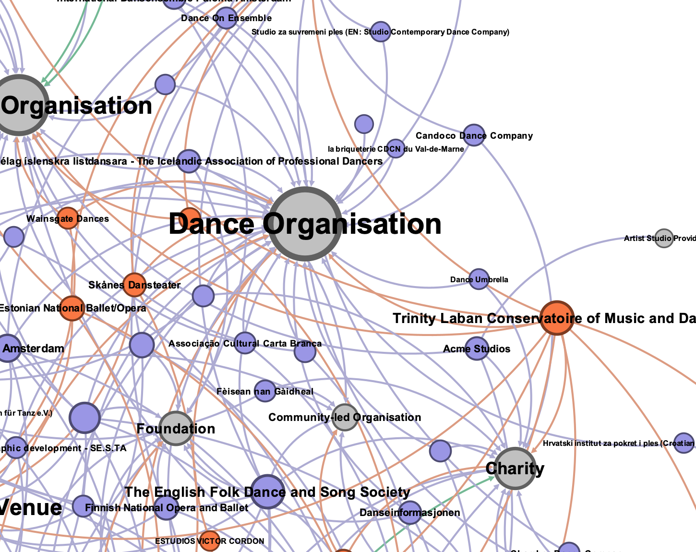
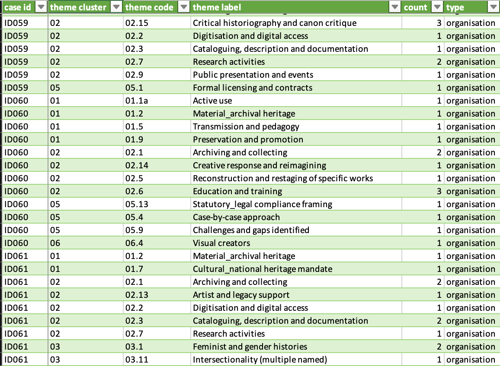

# WP2: Mapping European Dance Heritage

### Coventry University / C-DaRE

### Joe Askew, Marie-Louise Crawley, Rachael Davies, Simon Ellis, Lily Hayward-Smith, Kathryn Stamp & Charlotte Waelde

Note:
Title slide. Update presenter name as needed. WP2 slot: 25-minute session (10 min presentation / 10 min Q&A, per Ben's guidance), immediately followed by WP1+8's combined slot – keep to time.

---

## WP2 overview

- Survey ➞ European dance heritage knowledge graph (shared with WP4)
- D2.1 (M3) and D2.2 (M18) delivered
- Analysis & application continue – not closed

Note:
WP2's objective is to feed survey data into the shared European artistic dance heritage Knowledge Graph – a single artefact developed jointly with WP4's Wikibase infrastructure, not two separate graphs. D2.1 (Survey tool) delivered M3; D2.2 (Knowledge Graph) submitted 29 June 2026 at M18. Both on schedule.

Frame this as ongoing, not "achieved" – analysis, enrichment and application of findings continue as part of WP2/3/4/7 collaboration. The Part B objectives table marks WP2 "Achieved," but the WP2 progress narrative itself says analysis continues – the latter is the more accurate framing to use here.

Reviewers already have the recruitment numbers and headline findings from the periodic report and D2.2 – do not restate them (540 invitations, 220 responses, 40.7%, 132 orgs/88 individuals, UK/Germany concentration, the UNESCO definitional-mismatch finding – all already in Part B pp.6–7). Today's focus: what's happened since D2.2, and what's still being worked through.

---

## Survey to graph

  

    <ul>
      <li class="fragment fade-up">Survey data ➞ Wikibase graph</li>
      <li class="fragment fade-up">Structured data ingested; open text is harder</li>
    </ul>
  

  

    

      
    

  

Note:
D2.2 supplied the survey-derived baseline population of actors and attributes into the shared Wikibase-hosted graph. The structured, closed-question data has gone in reasonably well; the free-text/open-ended fields are the harder, still-developing part – this sets up the open-text discussion later in the deck.

Avoid discussing WP4 tooling specifics (e.g. OpenRefine) unless asked directly – not your area to defend. Note for your own awareness only, not for the room: Part B (WP4 progress) reports survey data as already ingested/reconciled via OpenRefine; D2.2's own technical section is more candid that OpenRefine struggles with the complex relational/open-text data specifically, and that alternatives are being explored. The more descriptive/structured fields are in reasonably well; open text is the real sticking point. Don't raise this discrepancy unprompted – only clarify if pressed.

---

## Challenges: third-party & marginalised data

- Hardest ethical terrain in the dataset
- 6 of 88 individuals declined to be named
- Third-party names redacted unless narrowly justified

[Visual: optional simple checklist/decision-tree graphic of the three-part test for retaining a third-party name.]

Note:
The hardest ethical terrain in the survey data. Six of 88 individual respondents declined to be named – their free text is withheld and their attributes suppressed so they can't be identified by combination.

Third parties named by respondents in free text are redacted unless all three hold: (1) named in a professional dance/heritage capacity, not a private one; (2) the stated information is already public; (3) the naming is incidental factual reference, not evaluative. Special-category information about a third party is always redacted regardless of public standing. Marginalised-practices text may itself contain special-category data.

This screening is currently done manually, applying the rules in the WP2 data-sharing and access guidelines (draft, 14 August 2026) – it's part of implementing the access model set out in D2.2, not unfinished WP2 deliverable work.

---

## Lessons: the weight of decisions

- Judgment calls at every stage (not only survey design)
- Responsibility to the future

Note:
Sampling, redaction, coding, and now access rules have all required deliberate, documented choices – not just the original survey design. Density of decisions/judgements runs through the whole WP, from instrument design through to who gets to see what, years from now.

Responsibility runs forward as well as back: to the people who gave their time and trust completing the survey, and to the wider field who will use this these. 

{Keep this reflective and process-focused – the standing methodological caveats (representativeness, self-report bias, translation) are already documented in D2.2 and the periodic report; this slide is about the process of deciding, not a limitations list.}

---

## Open question: access to rich open-text data

  

    <ul>
      <li class="fragment fade-up">Richest material, hardest to share responsibly</li>
      <li class="fragment fade-up">Controlled tier: redacted dataset + coding framework + coding matrix only</li>
      <li class="fragment fade-up">The NVivo project itself will never be released</li>
    </ul>
  

  

    

      
    

  

Note:
The open-text fields are analytically the richest material in the dataset and the hardest to make available responsibly. Under the draft access guidelines, the controlled tier (case-level, signed agreement) holds only: the redacted case-level dataset (XLSX), the redacted coding framework, and a derived coding matrix (case ID × theme label, containing no verbatim text). Single-case themes in theme clusters 03/05/06 are reviewed and suppressed or merged where they could re-identify a respondent.

The NVivo project itself – which retains un-redacted free text – will never be released, at any tier. Still open: how much of the text itself can ever be shared, beyond short attributed quotations in outputs.

---

## What's next?

- Sign-off of the data-sharing & access guidelines
- DMP amendment ➞ v2 (holdings, licensing, barriers)
- Disclosure-risk assessment – precondition for marginalised text
- Deposit via a trusted repository

Note:
WP2's deliverables are complete; these are governance and access items being carried forward with WP1 and the coordinator – not open WP2 deliverable work.

Sign-off of the data-sharing & access guidelines sits with the coordinator – may land around the time of this meeting, so check status on the day rather than asserting one.

The DMP amendment (draft, 3 August 2026) corrects survey-data holdings (a previously undocumented copy at UAnt, and partner view-access during collection), corrects licensing (case-level survey data cannot carry an open licence – respondents retain copyright in free text; open release is limited to extracted facts, aggregates and metadata), and formally documents sharing barriers that the original DMP had said didn't exist. Going into DMP v2.

Completing the disclosure-risk assessment is the specific precondition the guidelines set for releasing marginalised-practices text – no date currently attached to it.

Deposit via a trusted repository with a persistent identifier, once the above are settled.

Deliberately no mention of controller/DPO status anywhere in this deck.

---

## Discussion prompts

a) Disclosure-risk assessment – the next concrete step
b) Access to the open-text data
c) Stress-testing the approval workflow
d) Protecting people vs. keeping data usable

Note:
a) The disclosure-risk assessment as next concrete step – worth raising since it's the actual gate on releasing marginalised-practices material, not a political point.
b) How best to give access to the open-text data – echoes the earlier slide.
c) Stress-testing the access-approval governance workflow (currently: coordinator as approver, C-DaRE as technical consultee) before real requests start arriving.
d) The tension underneath this whole deck: protecting third parties and marginalised respondents versus keeping the data genuinely usable.

Use whichever land in the room – this is the last slide before Q&A closes and before the day's final general-questions slot; no need to force all four.
