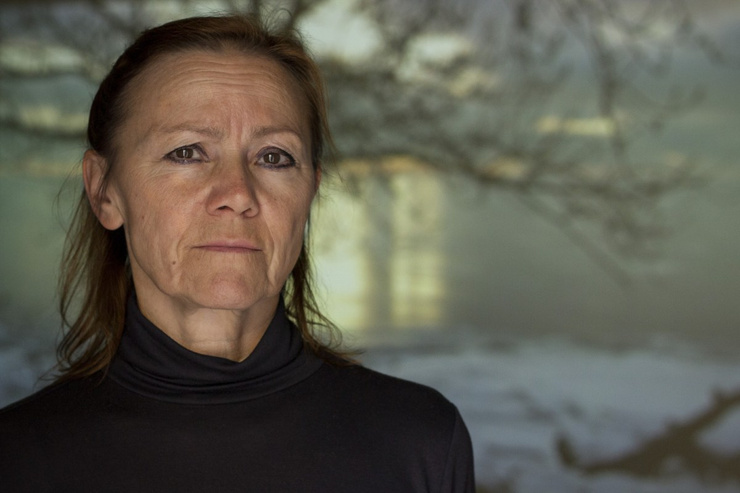

<!-- blank -->

---

## Threshold of the self
### Practice research and the question of data

Simon Ellis

---

## shimmer

  <iframe id="video-shimmer-again" title="Shimmer" src="https://player.vimeo.com/video/1228371997?h=5546a124a0" allow="autoplay; fullscreen" sandbox="allow-same-origin allow-scripts allow-popups allow-forms"></iframe>
  <button class="video-fullscreen-btn" type="button" data-target="video-shimmer-again" aria-label="Play fullscreen"></button>

Note:

---

## Reflection

- things you noticed
- relfecting on your experience 

Note:
solo -- 3-4 minutes
pairs -- 
annotate as i go? 

---

## Data

data is the plural of Latin datum – “something given”, from dare, “to give”.

Note:

In research, data are materials treated as given for analysis: observations, measurements, records, texts, images or other traces from which claims are developed.
The term can therefore carry an assumption of givenness or separability: that something can be identified, recorded, extracted or held sufficiently stable to become an object of analysis.

---

## Five positions on data in practice research

Note:

---

## Haseman (2006)

<h3>Expand the category</h3>

Artistic forms can function as symbolic data.

Note:
> Performative research expressed in nonnumeric data, but in forms of symbolic data other than words in discursive text. These include material forms of practice, of still and moving images, of music and sound, of live action and digital code.

---

## Gisler (2018)

<h3>Call it material</h3>
<blockquote>An artist might generate material (not data, as the sociologist would tend to say) by observation, interviews, dreams, memories, etc.</blockquote>

Note:
- smells as sweet. also requires translations in some contexts

---

## Nelson (2006)

<h3>Differentiate categories</h3>

Keep different evidential and knowledge categories distinct.

Note:

---

## Arlander (2017)

<h3>Make the categories relational and mobile</h3>

Data, material and output are relational and mobile.

Note:
"the role of research data or material and the role of research output can be interchangeable, mixed or hybridized" (p.174)

---

## ELIA (2025)

<h3>Question the institutional regime surrounding the category</h3>
<blockquote>There is no such thing as 'only data' [...] Data as a concept is already an ideology.</blockquote>

Note:
- European League of Institutes of the Arts (ELIA) Artistic Research Working Group: European network representing higher arts education institutions, including art, design, music, theatre, dance and related fields
- ideological response to ideology (as if one can overwhelm ideology with more of a different colour)?
- demello: As soon as you look at the world through an ideology you are finished. No reality fits an ideology. Life is beyond that.

---

## Losing oneself (2024)

- artistic research into unstable or disappearing selfhood during authentic movement
- multi-methods (but primarily practice research)
- KC, MM, MG, SE | losingoneself.coventry.ac.uk
- first-person experience, conversations and documentation
- examined agency, attention and nondual awareness

Note:

---

## So far

- shimmer (video)
- positions on data
- losing oneself (the project)

---

<h2 class="dft-title">Bifurcation</h2>

Note:
flowchart — starting point, Practice only

---

<h2 class="dft-title">Bifurcation</h2>

Note:
flowchart — right leg, stage 1 of 4 (audiovisual recordings)

---

## Audiovisual recordings

- no clear plan/outcome in mind
- timelapse from 3 stills cameras 
- single 4k video footage from fixed camera

Note:
- habit of recording through AV information as best as possible (keeping in mind the possibility of the material becoming useful) -- shotgun approach to data collection / documentation
- a lot of av information
- timelapses on different times 

---

<h2 class="dft-title">Bifurcation</h2>

Note:
flowchart — right leg, stage 2 of 4 (post-production concept)

---

## post-production concept

- motion extraction
- coincidence of timing

Note:
- coincidence of seeing @PosyMusic (youtuber) 'motion extraction' post-prod technique (<https://www.youtube.com/watch?app=desktop&v=NSS6yAMZF78>)
- became interested in testing motion extraction (worked with Heinrich)
- link between primary experiences of 'loss of sense of time' in the dancing, and the post-prod manipulation of time (to reveal motion detail)

---

<h2 class="dft-title">Bifurcation</h2>

Note:
flowchart — right leg, stage 3 of 4 (editing)

---

## editing

- practice of making art
- decision over-load

Note:
- very familiar experience 
- very hard to make decisions / working intuitively

---

<h2 class="dft-title">Bifurcation</h2>

Note:
flowchart — right leg, terminal stage (4 of 4) (output (shimmer))

---

## output (shimmer)

- an art object (?)
- relationship to initial curiosity / theme? 
- relationship to experience within the practice? 
- documentation?

Note:
- fragile relationship if any to the 'theme' of my initial curiosity 
- paper-thin relationship to the practice (and the experience of it from the inside)
- is it emergent? 
- what can I say about it as research? 
- certainly doesn't feel like data -- what do data feel like? 
- maybe it is leaning towards art (even if only a first draft/iteration
- just because it came from a period of researchful activity (and practice) does not make it research??? 
- could it be 2º data from the practice? 
- is it documentation? no way. 

---

<h2 class="dft-title">Bifurcation</h2>

Note:
flowchart — left leg, stage 1 of 5 (experiential/discursive)

---

## Experiential / discursive

Note:
TODO — left leg, stage 1 of 5

---

<h2 class="dft-title">Bifurcation</h2>

Note:
flowchart — left leg, stage 2 of 5 (conversations + interviews)

---

## Conversations + interviews

Note:
TODO — left leg, stage 2 of 5

---

<h2 class="dft-title">Bifurcation</h2>

Note:
flowchart — left leg, stage 3 of 5 (transcription)

---

## Transcription

Note:
TODO — left leg, stage 3 of 5

---

<h2 class="dft-title">Bifurcation</h2>

Note:
flowchart — left leg, stage 4 of 5 (thematic/search analysis)

---

## Thematic / search analysis

Note:
TODO — left leg, stage 4 of 5

---

<h2 class="dft-title">Bifurcation</h2>

Note:
flowchart — left leg, terminal stage (5 of 5) (Chapter (terminal))

---

## Chapter

Note:
TODO — left leg, terminal stage (5 of 5)

---

## References

Haseman, B. (2006). A Manifesto for Performative Research. <em>Media International Australia</em>, 118, 98–106.

Gisler, Priska (2018), “Explaining,” in Celia Lury et al. (eds), Routledge Handbook of Interdisciplinary Research Methods, Abingdon: Routledge, p. 303.

Nelson, R. (2006) <em>Practice-as-Research and the Problem of Knowledge</em>. Performance Research 11 (4), 105–116

Arlander, A. (2017). Data, Material, Remains. In M. Koro-Ljungberg (Ed.), <em>Disrupting Data in Qualitative Inquiry: Entanglements with the Post-Critical and Post-Anthropocentric</em>. Peter Lang.

ELIA (2025). Towards a Manifesto for Critical Openness in Artistic Research (Score, Version #1). ELIA Artistic Research Working Group. https://cdn.ymaws.com/elia-artschools.org/resource/resmgr/elia_library/Towards-a-Manifesto_for-Crit.pdf

